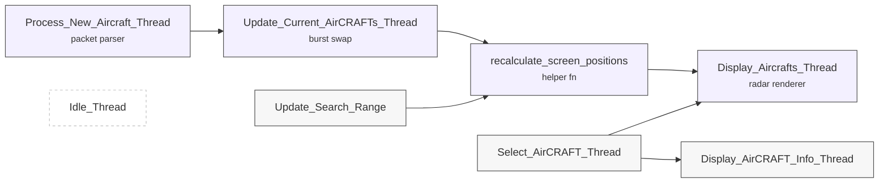

# RTOS Flight Tracker

Real‑time embedded radar that visualises live aircraft traffic on a **TM4C123G LaunchPad** driving a **240 × 320 ST7789 Display**. Telemetry is streamed from the OpenSky Network over UART; a lightweight **G8RTOS** micro‑kernel orchestrates deterministic rendering, user input and data processing.

---

## Introduction

This project turns a micro‑controller into a self‑contained **mini‑radar**. A Python script running on a BeagleBone Black (or any Linux host) periodically queries the OpenSky REST API, packs each aircraft’s state vector into a fixed‑width binary frame and streams it out over **UART @ 115,200 baud**.
On the LaunchPad, an ISR decodes the stream into a FIFO; real‑time threads perform coordinate reprojection and render range rings, track vectors and call‑signs.
User interaction is handled with a 2‑axis analogue joystick and four buttons wired through a PCA9555 I/O expander.

---

## Key Features

| Category                      | Highlights                                                                                                     |
| ----------------------------- | -------------------------------------------------------------------------------------------------------------- |
| **Real‑time path**            | 50 Hz UART ISR → lock‑free FIFO → double‑buffered aircraft tables → ST7789 refresh                             |
| **Interactive UI**            | Joystick angle hops to the nearest aircraft in that heading; click to auto‑select the closest‑to‑centre target |
| **Dynamic range**             | SW1/2 increase or decrease search radius in 10 km steps (20 – 200 km) with instant coordinate re‑projection    |
| **Heading & track vectors**   | Dotted line projected 30 px ahead of aircraft symbol for intuitive situational awareness                       |
| **Lossless telemetry format** | Little‑endian packet: `IIiiiii` → two 4‑byte call‑sign shards + five scaled `int32` fields                     |
| **Double buffering**          | *stagingAircrafts* array receives burst; semaphore‑guarded swap eliminates tearing on screen                   |
| **Meridian‑aware math**       | Longitude scaling uses `cos(φ₀)` so circles stay circular at Gainesville’s latitude                            |
| **Zero‑copy FIFOs**           | RTOS FIFO holds raw `int32` words—no heap, no memcpy                                                           |
| **Low‑power idle**            | `Idle_Thread` executes `WFI`; MCU sleeps at < 2 mA when no updates are pending                                 |

---

## Demo Video

---

## How Distance & Heading Are Computed

### 1 Angular deltas

$$
\begin{aligned}
\Delta\varphi &= \varphi_{\text{ac}} - \varphi_0 \\\\
\Delta\lambda &= \lambda_{\text{ac}} - \lambda_0
\end{aligned}
$$

### 2 Convert to kilometres (local tangent plane)

$$
\begin{aligned}
k_{\varphi} &= 111.32\,\text{km/°} \\\\
k_{\lambda} &= 111.32\,\cos\varphi_0\,\text{km/°}
\end{aligned}
$$

$$
\begin{aligned}
\Delta y_{\text{km}} &= \Delta\varphi\,k_{\varphi} \\\\
\Delta x_{\text{km}} &= \Delta\lambda\,k_{\lambda}
\end{aligned}
$$

### 3 Range & bearing

$$
D = \sqrt{\Delta x_{\text{km}}^{2} + \Delta y_{\text{km}}^{2}},\qquad
\theta = \mathrm{atan2}\!\bigl(\Delta y_{\text{km}},\,\Delta x_{\text{km}}\bigr)
$$

### 4 Scale to pixels

Outer ring radius \(R_{\max}\) maps to 100 px:

$$
s = \frac{100\,\text{px}}{R_{\max}},\qquad
x = x_0 + s\,D\,\cos\theta,\qquad
y = y_0 - s\,D\,\sin\theta
$$

### Track vector (dotted heading line)

A constant-length track cue (\(\ell = 30\;\text{px}\)) is drawn using the aircraft’s true track \(\psi\):

$$
\begin{aligned}
x_{\text{end}} &= x + \ell\,\cos\!\bigl(90^{\circ} - \psi\bigr) \\\\
y_{\text{end}} &= y + \ell\,\sin\!\bigl(90^{\circ} - \psi\bigr)
\end{aligned}
$$

---

### Thread / ISR Timelines

| Priority  | Context                           | Purpose                          |
| --------- | --------------------------------- | -------------------------------- |
| **0 – 2** | ISRs                              | UART4, GPIO → semaphore kick     |
| 1         | `Process_New_Aircraft_Thread`     | Parse packet into staging buffer |
| 2         | `Update_Current_Aircrafts_Thread` | Burst swap + reprojection        |
| 10        | `Select_Aircraft_Thread`          | Joystick vector → target         |
| 11        | `Display_Aircrafts_Thread`        | Radar redraw                     |
| 13        | `Display_Aircraft_Info_Thread`    | Info overlay                     |
| 255       | `Idle_Thread`                     | `WFI` sleep                      |

---

## Architecture Diagram

## System Diagram

---

## Technologies Used

| Domain      | Stack                                                                                  |
| ----------- | -------------------------------------------------------------------------------------- |
| Firmware    | **C17**, TI TivaWare 2.2, **G8RTOS**                                                   |
| Display     | ST7789 SPI @ 15 MHz, custom dotted‑line renderer                                       |
| Data ingest | Python 3.12, `requests`, `pyserial`, `struct`                                          |
| Toolchain   | `arm-none-eabi-gcc` 13, `openocd` + CMSIS‑DAP                                          |
| Hardware    | TM4C123GXL LaunchPad, ST7789 240×320 IPS, joystick (PD6/7 ADC), PCA9555, UART4 (PD4/5) |

---

## Hardware wiring

   | Signal       | LaunchPad Pin | Peripheral   |
   | ------------ | ------------- | ------------ |
   | SPI CLK      | **PB4**       | ST7789 SCK   |
   | SPI MOSI     | **PB7**       | ST7789 DIN   |
   | SPI CS       | **PB5**       | ST7789 CS    |
   | DC/RS        | **PB6**       | ST7789 D/C   |
   | RESET        | **PE1**       | ST7789 RST   |
   | UART4 TX/RX  | **PD5 / PD4** | Host SBC     |
   | I²C SDA/SCL  | **PB3 / PB2** | PCA9555      |
   | ADC0/1       | **PD7 / PD6** | Joystick X/Y |

---

## Usage & Controls

| Control            | Action                                    |
| ------------------ | ----------------------------------------- |
| **SW1 / SW2**      | ±10 km search radius                      |
| **SW3**            | Toggle track vector                       |
| **SW4**            | Toggle call‑sign labels                   |
| **Joystick click** | Select nearest aircraft                   |
| **Joystick tilt**  | Hop to nearest aircraft in that direction |

---

## License

Released under the **MIT License** – see [`LICENSE`](LICENSE) for full text.

---

> *Cannon Spencer · University of Florida · November 2024*
